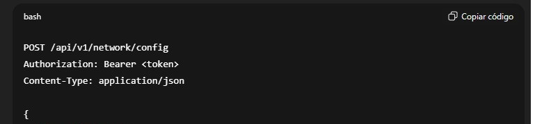

# NetGuard Pro – Documento Inicial del Proyecto

## Descripción General del Producto
NetGuard Pro es una plataforma empresarial diseñada para optimizar, proteger y escalar infraestructuras de red modernas. Su arquitectura modular integra monitoreo avanzado, análisis inteligente de tráfico, controles de seguridad en tiempo real e integración nativa con entornos de nube líderes.
El propósito principal del proyecto es proporcionar a organizaciones de todos los tamaños un sistema confiable que mejore la visibilidad, automatice tareas operativas y minimice los riesgos de seguridad sin complejidad innecesaria.

## Flujo para Nuevos Usuarios

### Instalación Sencilla
Siga este flujo recomendado para realizar una instalación rápida:
- Acceda al sitio oficial de NetGuard Solutions y navegue a la sección Descargas.
- Seleccione el instalador correspondiente a su sistema operativo: Windows Server 2016/2019, Ubuntu 20.04+, CentOS 7+ o macOS 10.15+.
- Ejecute el instalador con permisos administrativos.
- Siga el asistente de configuración para definir parámetros iniciales de red.
- Configure un usuario administrador seguro.
- Ingrese su clave de licencia o seleccione la opción de prueba gratuita de 30 días.
- Una vez completado el proceso, acceda al panel principal para visualizar métricas iniciales.

### Funciones Clave

- **Optimización de Red** NetGuard Pro identifica automáticamente cuellos de botella, distribuye de manera dinámica el ancho de banda y ofrece métricas de rendimiento en tiempo real.
- **Seguridad Avanzada** El sistema implementa políticas de firewall, monitoreo de amenazas y cifrado TLS 1.3 para garantizar comunicaciones seguras y detección inmediata de actividades sospechosas.
- **Escalabilidad Sin Interrupciones** La aplicación integra balanceo de carga y conectividad con AWS, Azure y Google Cloud, facilitando el crecimiento progresivo sin necesidad de reconfigurar toda la red.

## Caso de Uso Práctico
La empresa X, un proveedor de servicios financieros, experimentaba interrupciones recurrentes debido al tráfico irregular generado por un grupo de servidores críticos. Además, múltiples alertas de seguridad indicaban intentos de acceso desde ubicaciones no autorizadas.
Tras implementar NetGuard Pro, la organización ejecutó el módulo de monitoreo continuo y activó las alertas inteligentes:
- El sistema detectó un patrón anormal en un servidor que consumía ancho de banda excesivo durante horarios nocturnos.
- Mediante la asignación dinámica de recursos, se garantizó que las aplicaciones de trading mantuvieran prioridad de tráfico.
- El firewall integrado bloqueó automáticamente intentos externos catalogados como riesgosos según reglas preconfiguradas.
En menos de dos días, la empresa logró estabilizar su red, reducir incidentes críticos en más del 60% y restablecer la continuidad operativa en horas de mayor demanda.

## Detalle Técnico para Desarrolladores

### Arquitectura General
El sistema está compuesto por varios módulos internos diseñados para operar de forma coordinada:
- Módulo de Monitoreo: recopila datos de tráfico utilizando agentes distribuidos.
- Módulo de Análisis: procesa patrones y tendencias para identificar anomalías.
- Módulo de Seguridad: gestiona políticas de acceso, firewall y alertas.
- Módulo de Integración: conecta servicios externos como Slack, PagerDuty y Splunk.
- API Central: expone endpoints REST para automatizar configuraciones y obtener métricas clave.

Consulta básica del estado de la red:

Authorization: Bearer <token>

### Requisitos Técnicos
- CPU mínima: Quad-core 2.5 GHz; recomendada: Octa-core 3.0 GHz.
- RAM mínima: 8 GB; recomendada: 16 GB.
- Almacenamiento: mínimo 500 GB; recomendado 1 TB SSD.
- Adaptador de red: 1 Gbps mínimo, 10 Gbps para despliegues empresariales.
- Compatibilidad con entornos híbridos y multicloud.

## Pautas de Contribución para Colaboradores

### Flujo de Trabajo para Contribuir
- Crear una rama separada para cada mejora o corrección.
- Seguir el estilo de código acordado y documentar funciones complejas.
- Escribir pruebas unitarias cuando corresponda.
- Enviar un pull request claro, con descripción del cambio y su propósito.

### Control de Calidad y Revisión
- Todas las contribuciones deben ser revisadas por al menos dos miembros del equipo.
- Los pull requests deben incluir evidencia de pruebas exitosas.
- Cada nueva funcionalidad debe mantener los principios de rendimiento, seguridad y escalabilidad.

## Contacto y Recursos
Los usuarios pueden comunicarse con NetGuard Solutions a través de los siguientes medios oficiales:

- Correo electrónico: [info@netguardsolutions.com](mailto:info@netguardsolutions.com)
- Teléfono de soporte general: +1-800-555-1234
- Línea de asistencia técnica prioritaria (empresas): +1-800-555-5678
- Oficina corporativa: NetGuard Solutions, Departamento de Atención Técnica
- Red profesional: LinkedIn - NetGuard Solutions

Para más información sobre nuestros servicios y propuestas, puedes consultar el folleto oficial de la empresa en el siguiente enlace:
[📄 Abrir documentación en PDF](Folleto.pdf)

Para documentación extendida, acceso a APIs o guías avanzadas, consulte el portal oficial de desarrolladores o contacte al equipo de soporte técnico mediante los canales anteriores